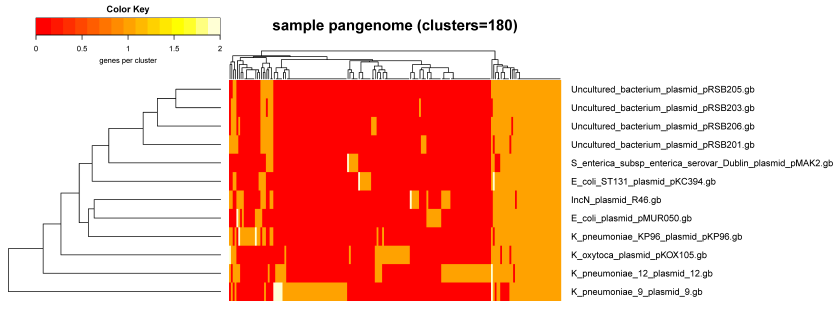

# Get_Homologues 分析 Pangenomes

---



!!! Abstract "内容简介"
    [get_homologues](http://eead-csic-compbio.github.io/get_homologues) 是一个用 perl 语言编写的应用软件。可以通过对蛋白质和核酸序列相似性来进行同源基因分组，并用来鉴定细菌 core-genomes 和 pan-genomes 的开源工具。

    - 软件版本: v 3.1.2
    - 官方网站: http://www.github.io/eead-csic-compbio/get_homologues
    - 聚类算法: BDBH/MCL/COG
    - 绘图: R > 3.3.0

## 1. 安装

使用 conda 建立一个单独的虚拟环境，采用其他安装方式也可以。

```bash
# 下载安装包，内含主要的依赖软件
# 最新版在github/release界面
$ wget https://github.com/eead-csic-compbio/get_homologues/releases/download/v3.1.2/get_homologues-x86_64-20180524.tgz
$ tar zxf get_homologues-x86_64-20180524.tgz -C get_homologues
$ cd get_homologues

# 新建一个虚拟环境
$ conda create -n get_homologues
$ conda activate get_homologues

# 安装 gd 依赖
(get_homologues)$ conda install perl-gd
# 如果没有安装系统级 R 语言，可以在虚拟环境里安装 r-base
(get_homologues)$ conda install r-base libcurl icu

# 下载 pfam 和 swissprot 数据库
(get_homologues)$ wget -P db/  ftp://ftp.uniprot.org//pub/databases/uniprot/current_release/knowledgebase/complete/uniprot_sprot.fasta.gz
(get_homologues)$ wget -P db/  ftp://ftp.ebi.ac.uk/pub/databases/Pfam/current_release/Pfam-A.hmm.gz

# 安装脚本也可以帮你自动下载并解压缩 pfam 和 swissprot 数据库
(get_homologues)$ ./install.pl

# 安装R额外功能依赖包，nlopt不是R包，在S3AMAZON服务器上，往往不能正常在R中下载，所以要手动通过代理下载。
(get_homologues)$ wget http://ab-initio.mit.edu/nlopt/nlopt-2.4.2.tar.gz
(get_homologues)$ wget https://cran.r-project.org/src/contrib/nloptr_1.0.4.tar.gz
(get_homologues)$ tar zxf nloptr_1.0.4.tar.gz
(get_homologues)$ cd nloptr
# 记录当前目录地址，即nlopt-2.4.2.tar.gz的本地路径
(get_homologues)$ pwd
(get_homologues)$ vim configure
# 将 `NLOPT_URL` 改成
NLOPT_URL='file:///path-to-nlopt-pkg/nlopt-2.4.2.tar.gz'
# 同样修改 configure.ac

# R CMD INSTALL 手动安装packages
(get_homologues)$ cd .. && R CMD INSTALL nloptr

# libcurl 支持
(get_homologues)$ pkg-config --libs libcurl
# 如果libcurl.pc 路径不正确，找不到的话，就需要手动指定 PKG_CONFIG_PATH
(get_homologues)$ export PKG_CONFIG_PATH='/path/to/libcurl.pc'

# 安装R额外功能
(get_homologues)$ R
> install.packages("gplots")
> install.packages("lme4")
> install.packages("dendextend")
> install.packages("factoextra")
> install.packages("ape")
```

## 2. 使用


### 绘制核心基因和泛基因图


## 3. 算法

get_homologues.pl 默认采用BDBH的算法，通过添加不同参数可以调用其他算法。

* `-G`: COG
* '-M': MCL (OrthMCL)

## 4. 示例

最后我们以一个例子大致介绍一下菌种的`Get_homologues`的`Pangenome`分析过程：`Bacillus cereus`基因组`assembly`数据库为例分析该物种的`Pangenomics`。

```bash
# 抓取 gbk 格式的 assembly 文件在 NCBI FTP 上的下载路径
$ esearch -db assembly -query "Bacillus cereus[ORGN] AND latest[SB]" | \
> efetch -format docsum | \
> xtract -pattern DocumentSummary -element FtpPath_RefSeq | \
> awk -F"/" '{print $0"/"$NF"_genomic.gbff.gz"}' > bcereus.path

# 运行 `cat bcereus.path`，你可以看到终端打印输出这些基因组在ftp服务器上的下载地址。
$ cat bcereus.path
ftp://ftp.ncbi.nlm.nih.gov/genomes/all/GCF/002/220/285/GCF_002220285.1_ASM222028v1/GCF_002220285.1_ASM222028v1_genomic.gbff.gz
ftp://ftp.ncbi.nlm.nih.gov/genomes/all/GCF/002/216/125/GCF_002216125.1_ASM221612v1/GCF_002216125.1_ASM221612v1_genomic.gbff.gz
ftp://ftp.ncbi.nlm.nih.gov/genomes/all/GCF/002/215/175/GCF_002215175.1_ASM221517v1/GCF_002215175.1_ASM221517v1_genomic.gbff.gz
...
```

接下来用 wget 工具的`-i`参数下载带路径的文件 bcereus.path。

```bash
# 用 wget 工具下载，并移动数据到文件夹gbk
$ wget --limit-rate 300k --no-passive-ftp -i bcereus.path
$ mkdir gbk && gunzip *.gz && mv *.gbff gbk

# 将菌株重新命名，以菌株号做为名称，一共24个基因组。
03BB87.gbk  A1.gbk     CMCC-P0011.gbk  D12_2.gbk  FORC_005.gbk  FORC021.gbk   FORC_047.gbk  FT9.gbk    ISSFR-3F.gbk  JEM-2.gbk  M13.gbk  NJ-W.gbk
3a.gbk      AR156.gbk  CMCC-P0021.gbk  FM1.gbk    FORC_013.gbk  FORC_024.gbk  FORC_048.gbk  HN001.gbk  ISSFR-9F.gbk  K8.gbk     M3.gbk   S2-8.gbk
```

get_homologues 默认使用 blast 进行序列相似性搜索，为了加快速度，也可以使用 `-X` 参数，调用diamond加快相似性比对。

```bash
# get_homologues 分析
$ get_homologues.pl -d gbk -n 40

# -X 调用 diamond 进行序列相似性搜索
$ get_homologues.pl -d gbk -n 40 -X

# 程序输出，可以看到输出的基因组基因数是有差异的，比如FT9的基因数特别少，只有4391个。
03BB87.gbk 5631
3a.gbk 5792
A1.gbk 5624
AR156.gbk 5456
CMCC-P0011.gbk 5895
CMCC-P0021.gbk 5899
D12_2.gbk 5248
FM1.gbk 5642
FORC021.gbk 5366
FORC_005.gbk 5313
FORC_013.gbk 5622
FORC_024.gbk 5345
FORC_047.gbk 5695
FORC_048.gbk 5329
FT9.gbk 4391
HN001.gbk 5860
ISSFR-3F.gbk 5457
ISSFR-9F.gbk 5446
JEM-2.gbk 5441
K8.gbk 5558
M13.gbk 5590
M3.gbk 5406
NJ-W.gbk 5355
S2-8.gbk 5797
```

当`get_homologues.pl`分析完成后，默认输出路径是 -d 对应目录名称加上 `_homologues`，那么本例就是 `gbk_homologues`，默认的算法是`BDBH`，也可以修改参数来使用`MCL`或`COG`来分析。

get_homologues.pl 会默认选择基因数最少的序列做为参考序列，数据在该序列名开头的文件夹中。

```bash
# 生成基因分布热图
$ compare_clusters.pl -o compare -m -d gbk_homologues/*_algBDBH_e0_
$ plot_matrix_heatmap.sh -i compare/pangenome_matrix_t0.tab -o pdf -r -H 8 -W 14 -m 28 -t "Bacillus cereus pangenome" -k "genes per cluster"

-i 输入.tab分析数据
-o 输出图片格式
-t 图片标题
-r 删除字段行
-H -W 高度和宽度
```

```bash
# 构建
$ parse_pangenome_matrix.pl -m compare/pangenome_matrix_t0.tab -s
```

## Reference

1. Bacterial Pangenomics, Methods and Protocols, Chapter14
2. [get_homologues manual](http://eead-csic-compbio.github.io/get_homologues/manual/manual.html)
