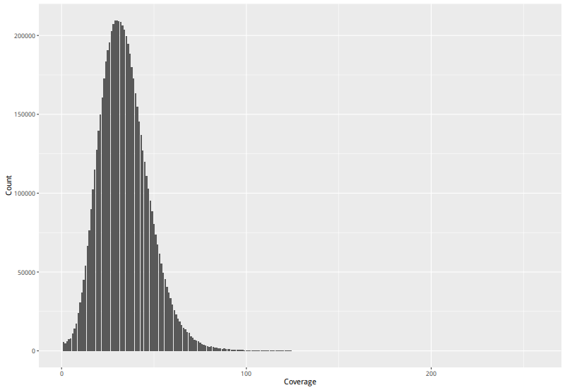

# 铜绿假单胞菌临床株与环境株SNP溯源

---

!!! Abstract "内容简介"
    利用高通量测序技术对铜绿假单胞菌(*Pseudomonas aeruginosa*)的临床分离株与环境分离株在基因组水平上进行SNP分析，从而溯源菌株并做耐药分析。
    内容完成情况：[=85% "85%"]

**分析方法**：

利用 bwa 将目标基因组 reads 比对到参考基因组，用 freebayes 做 variant calling，获得各个样本的 SNPs，根据结果做进一步分析。

**应用工具**:

- bwa
- samtools
- freebayes
- vcffilter

**实践意义**：可以作为今后实验室开展病原菌溯源工作的一个技术指导依据。

## 1. 提出问题

工作流程将从以下几个方面对于这个案例开展数据分析：

1. 测序质量: reads的长度，插入片段的长度
2. 将测序数据比对到参考基因组ST17
  - 每个样品reads的分布情况
  - 每个样品的基因组测序覆盖度
  - 不同样品之间的差异，特别是当设置不同的过滤参数时的情况：
    + Quality filter: QUAL > 100
    + Likelihood filter: QUAL / AO > 10
    + Variant frequency filter: AO / DP > 0.9 (90% allele frequency)
- 哪一个水龙头水样的分离株最有可能是感染源。(方法: 用`vcfsamplediff`比较环境株与临床株SNPs数量)
- 2个病人分离株之间使用了大量的抗生素治疗，哪一个获得、得了耐药性？
  * 用 joint calling 来比较2个临床样品数据，并用`vcfsamplediff`分析
  * 对于获得的大量SNPs，是否需要过滤以及如何过滤
  * 了解SNPs的分布规律
  * 重点查看SNPs

## 2. 分析流程

### 2.1 下载数据

数据可以从[这里](http://www.microbesng.uk/filedist/pseudomonas-practical/)下载获得，可以用`wget -m`递归下载路径下所有文件。文件包括：

- TAP1 - 病房1号水龙头水样中分离的菌株
- TAP2 - 病房2号水龙头水样中分离的菌株
- TAP3 - 病房3号水龙头水样中分离的菌株
- PATIENT1 - 服用抗生素后的病人分离株
- PATIENT2 - 一周内进一步服用抗生素的病人分离株

```bash
# 新建一个目录，数据和操作均在里面进行
$ mkdir pae-case && cd pae-case

# 下载数据文件
$ wget -m http://www.microbesng.uk/filedist/pseudomonas-practical/
$ mv www.microbesng.uk/filedist/pseudomonas-practical/* .
```

wget 的 -m 参数可以递归下载。

!!! warning
    数据下载地址目前已经失效！

### 2.2 建立 ST17 型参考菌株索引

软件使用`bwa`来对参考基因组ST17建立索引，以便后续比对。

```bash
$ bwa index ST17.fasta
```

### 2.3 将测序 reads 比对到 ST17 并排序索引

用`bwa mem`进行比对，输出的结果通过管道由samtools转换成BAM文件并进行排序和索引

```bash
$ bwa mem -t 4 -R '@RG\tID:TAP1\tSM:TAP1' ST17.fasta \
> TAP1_R1_paired.fastq.gz TAP1_R2_paired.fastq.gz | \
> samtools view -bS - | samtools sort - TAP1.sorted
$ samtools index TAP1.sorted.bam
```

!!! note "参数介绍"
    * -t 4: 表示使用4线程，根据自己的计算机CPU资源设置。
    * -R '...': 设置reads的ID，\t为制表符会转义成tab键。

对其他2株环境株和2株临床株重复以上步骤。

### 2.4 绘制测序 reads 的覆盖度

bam文件含有比对的信息，可以用`stats`参数查看

```bash
$ samtools stats TAP1.sorted.bam | grep "maximum length"
$ samtools stats TAP1.sorted.bam | grep "insert size"
$ samtools stats TAP1.sorted.bam | grep "^COV" > TAP1.coverage.txt
```

将截取的覆盖度相关信息保存成`.txt`文件，在R里用ggplot2绘制覆盖度图：

```r
> library(ggplot2)
> cov=read.table("TAP1.coverage.txt", sep="\t")
> cov[1,]
> ggplot(cov, aes(x=V3, y=V4)) + geom_bar(stat="identity") + xlab("Coverage") + ylab("Count")
```



### 2.5 比较1号临床株与环境株的SNPs差异

用同样的方法对其他几个样本进行操作，获得sorted的bam格式文件，用`freebayes`对临床与环境株比较获得vcf文件。然后用vcflib工具过滤`QUAL/AO>10`的部分(VCF元数据部分可以参考[文档](http://samtools.github.io/hts-specs/VCFv4.1.pdf))，并用`wc-l`计算行数统计结果。

```bash
$ freebayes -p 1 -C 5 -f ST17.fasta TAP1.sorted.bam PATIENT1.sorted.bam  > compare_tap1.vcf
$ vcffilter -f "QUAL / AO > 10" compare_tap1.vcf | vcffilter -f "NS = 2" | wc -l

6685
```

获得临床株与环境株之间的SNP差异数量，结果表明这2株之间只有5个SNPs。

```bash
$ vcfsamplediff SAME TAP1 PATIENT1 compare_tap1.vcf | vcffilter -f "QUAL / AO > 10" | vcffilter -f "NS = 2" | vcffilter -f "! ( SAME = germline ) " | grep -v "^#" | wc -l

5
```

用`vcfsamplediff`了解SNPs差异的基因，可以知道是那些gene/CDS里面发生了变化，还可以根据定位看突变是否是同义突变。如果snps数量接近无法区分，但是定位的基因有差异，那么菌株的溯源还需要进一步考虑。

```bash
$ vcfsamplediff SAME PATIENT1 TAP1 compare_tap1.vcf  | vcffilter -f "QUAL / AO > 10" | vcffilter -f "NS = 2" | vcffilter -f "! ( SAME = germline ) " > tap_differences.vcf
$ bedtools intersect -a ST17.gff -b tap_differences.vcf | awk -F";" '{print NR, $2}' OFS="\t"
```

结果输出：

```bash
1	gene=yfiR
2	inference=ab initio prediction:Prodigal:2.60,similar to AA sequence:RefSeq:YP_261793.1,protein motif:TIGRFAMs:TIGR03756,protein motif:Pfam:PF06834.5
3	inference=ab initio prediction:Prodigal:2.60,similar to AA sequence:RefSeq:YP_261793.1,protein motif:TIGRFAMs:TIGR03756,protein motif:Pfam:PF06834.5
4	gene=trbL
5	inference=ab initio prediction:Prodigal:2.60,similar to AA sequence:RefSeq:YP_001349879.1,protein motif:Cdd:COG3481,protein motif:TIGRFAMs:TIGR03760,protein motif:Pfam:PF07514.5
```

### 2.6 2个临床株的耐药变迁

了解2个临床株的SNPs差异，并查看这些SNPs所影响的gene

```bash
$ freebayes --ploidy 1 -C 5 -f ST17.fasta PATIENT1.sorted.bam PATIENT2.sorted.bam > compare_patient.vcf
~$ vcfsamplediff SAME PATIENT1 TAP1 compare_patient.vcf  | vcffilter -f "QUAL / AO > 10" | vcffilter -f "NS = 2" | vcffilter -f "! ( SAME = germline ) " > patient_differences.vcf
$ bedtools intersect -a ST17.gff -b patient_differences.vcf | awk -F";" '{print $2}'
```

---

## 3. 用 Snippy 来实现

大量的日常工作或者不熟悉各种命令行工具使用的话，就需要更简便的软件或者pipelines来帮助完成整个分析工作。因此这里我们使用[snippy](https://github.com/tseemann/snippy/blob/master/bin/snippy)来实现分析SNPs，并绘制基于snps的进化树。


### 3.1 安装 Snippy

Snippy是比较适合新手的工具，它提供了All in One的工具套装。虽然Snippy需要以下软件支持：

- Perl >= 5.6
- BioPerl >= 1.6
- bwa mem >= 0.7.12
- samtools >= 1.1
- GNU parallel > 2013xxxx
- freebayes >= 0.9.20
- freebayes sripts ( freebayes-parallel,fasta\_generate\_regions.py)
- vcflib (vcffilter, vcfstreamsort, vcfuniq, vcffirstheader)
- vcftools (vcf-consensus)
- snpEff >= 4.1

但这些工具在Snippy安装包里都已经提供了，我们只需要根据自己的系统设置将以来工具添加到系统路径中去即可。对于perl的一些模块，可能需要更新后才能正常使用：`sudo cpan -u module_name`

```bash
$ wget https://github.com/tseemann/snippy/archive/v2.9.tar.gz
$ tar xzf v2.9.tar.gz -C ~/app
$ echo "export PATH=$PATH:$HOME/app/snippy-2.9/bin:$HOME/app/snippy-2.9/binaries/linux/" >> /.bashrc
$ source ~/.bashrc
# update all perl module
$ sudo cpan -u
```

### 3.2 使用 Snippy

Snippy 不仅可以获得SNP(包括MultiSNP)，也可以获得insertion, indeletion以及Comibination。文本格式的结果记录文件中的snps.tab中，也可以用浏览器打开snps.html查看。

```bash
$ snippy --cpus 4 --outdir output1 --ref ST17.fasta \
> --R1 TAP1_R1_paired.fastq.gz --R2 TAP1_R2_paired.fastq.gz
$ head output/snps.tab

# snps.txt对各种突变位点做一个数据统计
$ cat output1/snps.txt
...
Software	snippy 2.9
Variant-COMPLEX	1124
Variant-DEL		27
Variant-INS		43
Variant-MNP		222
Variant-SNP		3351
VariantTotal	4767

# 计算不同

# 了解不同碱基的SNP变化数量，如T->C的SNP数量
$ awk '$10=="T=>C" {n++} END{print n}' output1/snps.gff
```

Snippy还可以生成多个基因组的共有SNPs的比对文件。用snippy分别生成3个TAP的snp列表数据到ouput*目录中，然后统计共有snps数量并生成snp序列文件aln。

```bash
# for old ubuntu system you need update outdated perl module List::Util
$ sudo cpan -u List::Util
$ snippy-core --prefix core output1 output2 output3
...
Found 30711 core SNPs from 42075 variant sites.
Saved SNP table: core.tab
Constructing alignment object for core.aln
...
```

如果要用raxml构建进化树，那获得的.aln文件还需要转换成.phy才可以使用。很多工具可以实现转换，这里使用网络服务来实现：http://sing.ei.uvigo.es/ALTER/

```bash
# RAxML 构建进化树
$ raxmlHPC -f a -x 12345 -p 12345 -# 100 -m GTRGAMMA -s core.phy -n pae -T 40
$ figtree RAxML_bestTree.pae
```

生成的进化树图类似下图


>因为比对的是fasta格式的文件，所以snps不止是编码区CDS的，而是整个基因组上的snps。

## 4. 用 Workflow 脚本来简化操作

对于我们实验室平时会有许多类似的SNP鉴定工作，那么下机数据要一个个操作会很繁琐，有时候我们通过 unix 的 pipeline 来简化或者写 pipeline 脚本来实现。而另一种解决方式是通过 Workflow 工具来自动化数据分析。专门的 Workflow 软件有许多，有些带GUI（如 galaxy 就可以建立图形化的 workflow），有些基于CML。对于在服务器上的生物信息学分析，我们一般都是丢给命令行来实现。Workflow 因此，这里使用基于 python 的 ruffus 来建立 workflow，作为一个示例演示如何简化平时大量重复的工作。

如果想了解更多关于 workflow/pipeline 的软件，可以查看以下网站：
 - [common-workflow](https://github.com/common-workflow-language/common-workflow-language/wiki/Existing-Workflow-systems)
 - [awesome-pipeline](https://github.com/pditommaso/awesome-pipeline)

### 4.1 准备数据

>undone


## 5. 如何选择 Reference

在做微生物SNP calling时，选择不同reference对结果是否会有影响？会有多大影响？这是具体分析时需要考虑的问题。有一些[文章](http://www.ncbi.nlm.nih.gov/pubmed/25144537)进行了讨论。对于我们实验室开展病原微生物溯源时，由于菌株一般是高度近源的，所以影响不大。对于做进化关系分析的，还是需要考虑snp的假阳性问题，通常是要对snp做 filtering。而且对于不同物种考虑其他的突变事件与重组在进化上的影响。

另一方面不同软件的流程与参数不同，对于不熟悉生物信息学的生物学家当使用`All in One`之类的套件工具分析时，可能会发现不同软件的结果会有不小的差异。因此还是要从自己研究的物种特点角度去选择软件，所以说最好对于这类工具的具体细节需要进行了解，特别是软件的参数。那么对于文档不全或者不够丰富的软件来说，就要仔细研读它的源代码来了解其实现方式，这也就是学习一些shell、python、perl等语言的原因之一了。

## 6. 参考资料

1. [Jupyter Notebook for Pseudomonas Practical](http://nbviewer.jupyter.org/github/nickloman/nickloman.github.com/blob/master/tutorials/Pseudomonas-practical.ipynb)
2. [Seeking the source of Pseudomonas aeruginosa infections in a recently opened hospital: an observational study using whole-genome sequencing.](http://bmjopen.bmj.com/content/4/11/e006278.full)
3. [Vcflib Git Repository](https://github.com/ekg/vcflib)
4. [Freebayes Git Repository](https://github.com/ekg/freebayes)
5. [Snippy](https://github.com/tseemann/snippy)
6. [VCF Document v4.1](http://samtools.github.io/hts-specs/VCFv4.1.pdf)
